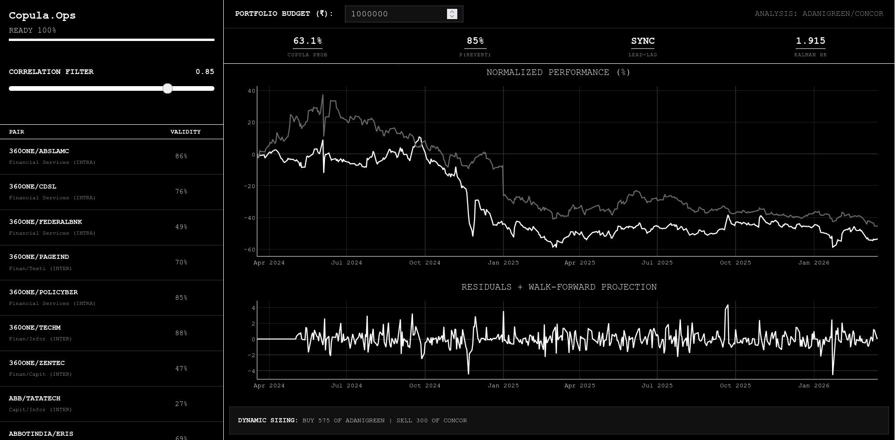

# Copula.Ops | Statistical Arbitrage Terminal

A statistical arbitrage terminal for the Nifty 750 universe. The system identifies mean-reversion setups using state-space estimation and tail-dependency analysis.



## Quantitative Architecture

### 1. Dynamic State Estimation (Kalman Filter)
The system uses a Recursive Kalman Filter to estimate the hedge ratio between two assets over time, rather than a static Ordinary Least Squares (OLS) regression.
* **State Transition**: $$x_t = A x_{t-1} + w_t$$
* **Observation**: $$z_t = H x_t + v_t$$

### 2. Tail-Dependency Modeling (Empirical Copula)
A Probability Integral Transform (PIT) is applied to the residuals to account for non-normal distributions.
* **Uniform Mapping**: Residuals are mapped to a uniform space [0, 1].
* **Copula Score**: Calculated via rank-order distributions to determine tail dependence.

### 3. Hurst Exponent Analysis
The Hurst exponent ($H$) evaluates the mean-reverting property of the spread.
* **Thresholds**: $H < 0.5$ indicates mean-reversion; $H > 0.5$ indicates a trend.
* **Implementation**: Calculated using the variance of differences at lag windows from 2 to 19 days via log-log regression.
* **Weighting**: Contributes up to 30% of the validity score.

### 4. Kurtosis Scoring
The system factors in the kurtosis of the spread distribution.
* **Objective**: Higher kurtosis indicates a higher probability of extreme deviations (fat tails).
* **Weighting**: Contributes up to 20% of the validity score.

### 5. Walk-Forward Validation
A 75/25 split is applied to the two-year lookback period.
* **Formation (75%)**: Engle-Granger test for initial cointegration.
* **Validation (25%)**: Out-of-sample testing to confirm stationarity. Pairs failing this phase are excluded.

### 6. Lead-Lag Detection
Cross-correlation of log returns is calculated across 11 lags (-5 to +5 days) to identify directional bias.
* **Formula**: $$Corr(r_{1,t-l}, r_{2,t})$$

---

## Infrastructure

### Data Pipeline
* **Universe**: Merges Nifty 500 and Nifty Smallcap 250 lists from NSE archives.
* **Lookback**: 2 years of daily data (~500 trading days).
* **Batching**: Data is downloaded via `yfinance` in 50-stock chunks.
* **Sync**: A background loop recalculates the universe every 4 hours.

### Execution Logic
* **Signals**: Based on a 30-day rolling Z-score of Kalman residuals.
* **Monte Carlo**: 500-path simulation using the Euler-Maruyama method over a 15-day window.
* **Friction Penalty**: A fixed penalty based on historical volatility is applied to simulated paths to approximate slippage.
* **Sizing**: Position sizes are calculated to neutralize the spread based on the live hedge ratio.

### Bonferroni Correction
Applied to the Engle-Granger test to control the family-wise error rate across multiple comparisons.
* **Adjusted Alpha**: $$\alpha = 0.05 / N_{unique\_idx}$$

---

## Technical Stack

* **Backend**: FastAPI, Python 3.11.
* **Processing**: NumPy, Pandas, Statsmodels, SciPy.
* **Frontend**: Vanilla JS, Plotly.js, Bootstrap 5.
* **Deployment**: Docker.

## Deployment
```bash
docker build -t copula-ops .
docker run -p 7860:7860 copula-ops
